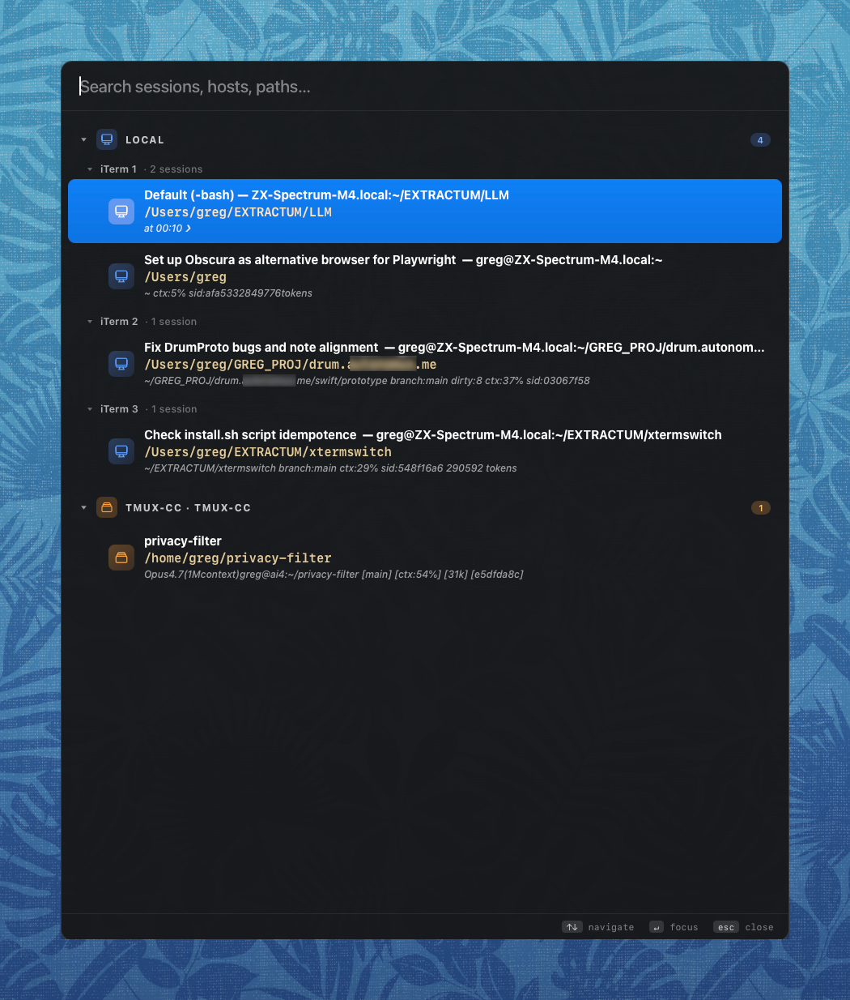

# xtermswitch

**A Spotlight for your terminals.** One hotkey opens a glassy, fuzzy-searchable
list of every iTerm2 session you have open — local windows, SSH targets,
tmux-CC panes on remote hosts — with the cwd, the running process, and a live
preview of what's happening on screen. Hit Enter to jump there.

<p align="center">
  
</p>

```
                             ⌘⌥⌃T
   ┌────────────────────────────────────────────────────────┐
   │  Search sessions, hosts, paths…                        │
   ├────────────────────────────────────────────────────────┤
   │  LOCAL                                              5  │
   │   iTerm 1                                              │
   │     🖥  ~/src/xtermswitch         claude  ●            │
   │     🖥  ~/work/billing-api        pytest               │
   │   iTerm 2                                              │
   │     🖥  ~/notes                   nvim                 │
   │  SSH · prod-1                                       2  │
   │     🌐 ~/services/api-gateway     tail -f              │
   │  TMUX-CC · staging-2                                3  │
   │     🪟 ~/repos/payments-svc      claude  ●            │
   │     🪟 ~/repos/payments-svc      go test               │
   │  ↑↓ navigate   ↵ focus   esc close                     │
   └────────────────────────────────────────────────────────┘
```

## Why

If you live in 30+ terminal sessions across local windows, `ssh` shells, and
tmux panes on remote hosts, finding the right one becomes a chore. iTerm's
own switcher only lists titles. xtermswitch shows you what you actually need
to recognize a session at a glance:

- **Where it is** — local window, which SSH host, which tmux-CC pane
- **What's running** — `claude`, `codex`, `vim`, `pytest`, plain shell
- **What you're doing** — current working directory
- **Whether it's busy** — live %CPU, "thinking…" detection, last meaningful
  output line

Type a few letters of a path or a hostname; press Enter; you're there.

## Highlights

- **One hotkey, one keypress to focus** — default `⌘⌥⌃T`, fully configurable
- **Grouped by location** — Local windows, then each SSH host, then tmux-CC
  controllers
- **Event-based iTerm2 cache** — optional iTerm2 Python daemon updates the
  picker cache on session, location, prompt, and screen events
- **Smart fuzzy search** across title, cwd, host, running command
- **Agent detection** — flags `claude` / `codex` sessions, shows live activity
- **Last-line preview** — strips ANSI/box-drawing noise, surfaces real output
- **Remote tmux-CC enrichment** — single batched SSH round-trip per host;
  works even with 30+ remote panes
- **Low idle cost** — the iTerm2 daemon updates on iTerm events; fallback
  AppleScript/SSH polling runs only while the picker is open
- **Glass UI** that floats over any app, dismisses on focus loss

## How it works

xtermswitch is three small processes that share one JSON file. Each piece is
independently useful and can be run on its own; together they keep the picker
responsive without polling iTerm in the background.

```
         ┌──────────────────────────────┐
         │  Hammerspoon module          │   xtermswitch.lua
         │  • global hotkey  ⌘⌥⌃T       │
         │  • glass-UI webview          │
         │  • merges + renders sessions │
         └──────────────┬───────────────┘
                        │ reads / file-watches
                        ▼
         ┌──────────────────────────────┐
         │  ~/.cache/xtermswitch/       │
         │     sessions.json            │   shared cache
         └────▲─────────────────────▲───┘
              │ event-driven        │ on-demand SSH +
              │ (writes on each     │ screen capture
              │  iTerm event)       │ (writes on every
              │                     │  picker open)
   ┌──────────┴───────────┐   ┌─────┴───────────────────┐
   │  iTerm2 Python       │   │  list-iterms (bash)     │
   │  daemon              │   │  • osascript walks      │
   │  • runs in iTerm2    │   │    iTerm windows/tabs   │
   │    via AutoLaunch    │   │  • SSH to each tmux-CC  │
   │  • subscribes to     │   │    host once, batched   │
   │    new/terminate/    │   │    via ControlMaster    │
   │    focus/screen/     │   │  • feeds picker on      │
   │    prompt events     │   │    every show() in case │
   │  • zero polling      │   │    daemon is unavailable│
   └──────────────────────┘   └─────────────────────────┘
```

**The picker** (`xtermswitch.lua`) is a Hammerspoon module. It owns the
hotkey, the borderless webview UI, and the in-memory session cache. While
the picker is closed it does literally nothing. When you hit `⌘⌥⌃T` it
loads the current `sessions.json`, paints the UI, starts a file-watcher on
the cache, and fires one bash refresh in the background.

**The iTerm2 daemon** (`iterm/xtermswitch_daemon.py`) is a long-running
script that iTerm2 launches at startup via its AutoLaunch hook. It uses
iTerm2's Python API to subscribe to session lifecycle, focus, screen, and
prompt notifications, then atomically writes an updated `sessions.json`
each time something changes. No polling — the daemon sleeps until iTerm
wakes it. Within ~80 ms of you typing in any iTerm pane, the picker (if
open) sees the new last-line.

**The collector** (`bin/list-iterms`) is a self-contained bash script that
walks iTerm via AppleScript, inspects `ps`/`lsof` for each local TTY, and
opens one batched SSH round-trip per remote host to query `tmux
list-panes` + `tmux capture-pane`. It produces the same JSON shape as the
daemon and serves two roles: (a) the fallback when the iTerm2 Python API
is disabled, (b) the source of remote tmux-CC enrichment (cwd, agent,
last-line) the daemon can't reach over the iTerm2 API alone. The picker
fires it once on every open so remote panes refresh promptly. SSH calls
reuse `ControlMaster` so the second call to a host is near-instant.

**The cache** is the contract between all three. It's a JSON array of
session records keyed by iTerm's stable `unique id`, plus an `updated_at`
timestamp. The picker's merge logic preserves whichever source has the
freshest reliable data per field, so the daemon and collector can run
concurrently without stepping on each other.

For deep-dive details (data shape, AppleScript dictionary, regex
heuristics for screen analysis), see [CLAUDE.md](CLAUDE.md).

## Requirements

- macOS
- [Hammerspoon](https://www.hammerspoon.org/) — `brew install --cask hammerspoon`
- [iTerm2](https://iterm2.com/) — `brew install --cask iterm2` —
  with Preferences → General → Magic → **Enable Python API** for event-based
  updates. AppleScript is still used as a fallback collector and for focusing
  selected sessions.
- `python3`, `osascript`, standard `bash` — preinstalled on macOS

`install.sh` checks for both apps and refuses to proceed if either is missing,
so a fresh machine gets clear next-step instructions instead of a silently
broken install.

## Install

```bash
git clone https://github.com/extractumio/xtermswitch.git ~/src/xtermswitch
~/src/xtermswitch/install.sh
```

You can clone into any directory; the installer records the absolute path to
that checkout in `~/.hammerspoon/init.lua`.

The installer is idempotent. Re-running it updates the wiring for the current
checkout and keeps existing user config intact. It:

1. checks required command-line tools
2. creates `~/.hammerspoon`, `~/.xtermswitch`, and `~/.cache/xtermswitch`
3. ensures `bin/list-iterms` and the iTerm2 daemon are executable
4. links the iTerm2 daemon into `~/Library/Application Support/iTerm2/Scripts/AutoLaunch/`
5. appends a one-line loader to `~/.hammerspoon/init.lua` (or creates one)
6. seeds `~/.xtermswitch/config.lua` from the example if it does not exist

First-run app steps:

1. In iTerm2, enable Settings/Preferences → General → Magic → **Enable Python API**.
2. Restart iTerm2, or run `Scripts → AutoLaunch → xtermswitch_daemon.py`.
3. In Hammerspoon, choose **Reload Config** from the menubar.
4. If macOS prompts for Automation access, allow Hammerspoon to control iTerm2.
5. Press `⌘⌥⌃T`.

The daemon writes `~/.cache/xtermswitch/sessions.json`; Hammerspoon watches
that file while the picker is open and falls back to the bash collector if the
daemon cache is missing or stale.

## Configuration

Edit `~/.xtermswitch/config.lua`. The most common knob is the hotkey:

```lua
return {
  hotkey = { mods = {"cmd", "alt", "ctrl"}, key = "T" },
  -- list_iterms = "/usr/local/bin/list-iterms",   -- override script path
  use_iterm_daemon     = true,
  iterm_daemon_cache   = os.getenv("HOME") .. "/.cache/xtermswitch/sessions.json",
  iterm_daemon_max_age = 10,
  cache_interval_open = 5,
  cache_interval_fast = 1.5,
  stale_ttl_seconds   = 15,
  stale_miss_limit    = 2,
  width_max     = 900,
  width_factor  = 0.55,
  height_factor = 0.80,
  show_load_alert = true,
}
```

See [`config.example.lua`](config.example.lua) for the full list.

## Keys

| Key                | Action                |
|--------------------|-----------------------|
| `⌘⌥⌃T`             | Open picker           |
| `↑` `↓`            | Move selection        |
| `Ctrl-N` `Ctrl-P`  | Move selection (vim)  |
| Type               | Fuzzy filter          |
| `↵`                | Focus selected        |
| `Esc`              | Close                 |
| Click on group     | Collapse / expand     |
| Click outside      | Close                 |

## Standalone CLI

The data collector is useful on its own:

```bash
./bin/list-iterms          # full YAML inventory
./bin/list-iterms json     # JSON for chooser UIs
./bin/list-iterms focus <session-uid>
```

## Privacy

xtermswitch reads iTerm session metadata, screen text from local panes (via
AppleScript), and tmux pane snapshots from remote hosts you've configured.
Everything stays on your machines. No telemetry, no network calls beyond the
SSH connections to hosts you already trust. See
[CLAUDE.md](CLAUDE.md) for a full data-flow walk-through.

## Troubleshooting

- **Picker is empty** — make sure iTerm has at least one window open and
  AppleScript automation is allowed (System Settings → Privacy & Security →
  Automation → Hammerspoon → iTerm2).
- **Daemon cache is not updating** — enable iTerm2's Python API, then restart
  iTerm2 or run `Scripts → AutoLaunch → xtermswitch_daemon.py`.
- **Remote panes show no `cwd` or `last line`** — the host needs `tmux` and
  `python3`, and SSH needs to connect with `BatchMode=yes` (key auth, no
  password prompt). Set up `ssh-agent` or `ControlMaster`.
- **Hotkey conflicts** — change `hotkey` in `~/.xtermswitch/config.lua`.

## Author

**Gregory Zemskov** — [info@extractum.io](mailto:info@extractum.io) ·
[linkedin.com/in/gregzem](https://www.linkedin.com/in/gregzem/)

## License

GNU Affero General Public License v3.0 or later (AGPL-3.0-or-later) —
see [LICENSE](LICENSE).

If you run a modified version of xtermswitch and let other users interact
with it over a network, the AGPL requires that you offer them the
corresponding source code of your modifications.
